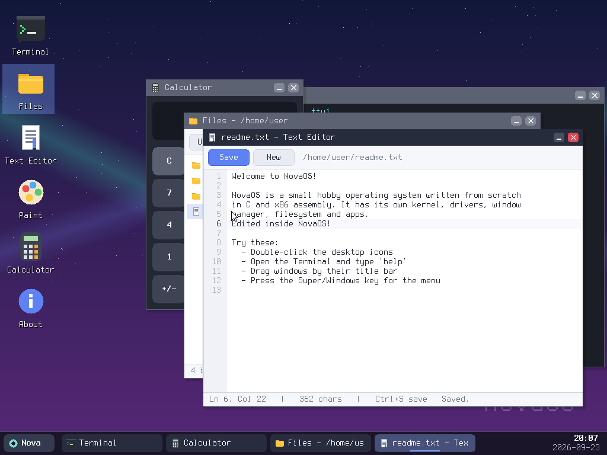
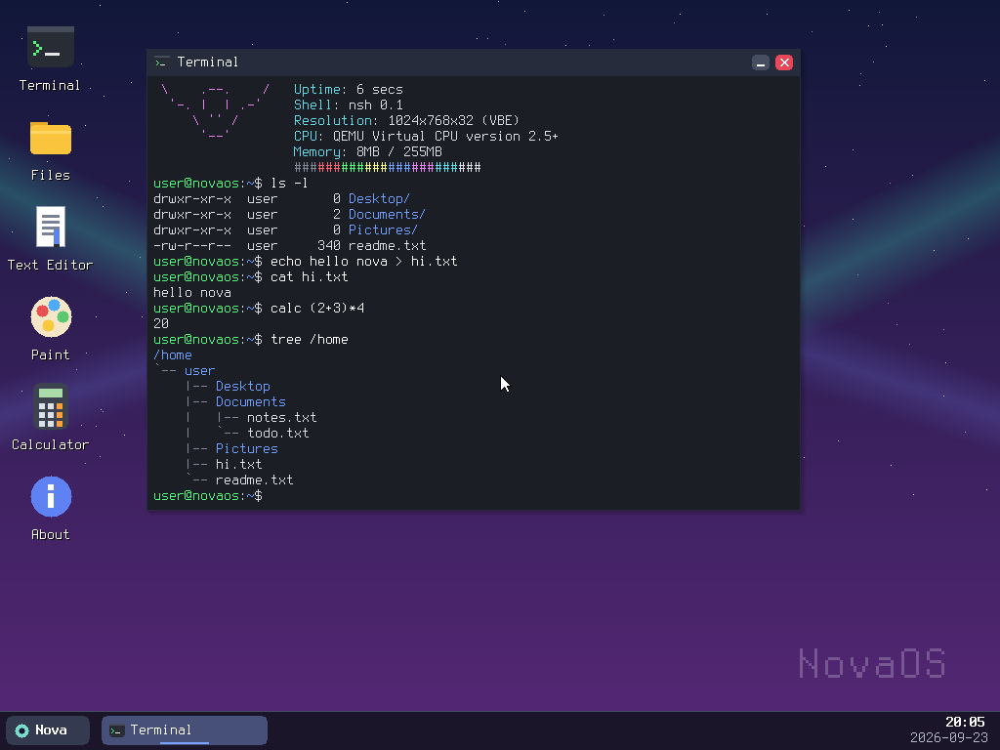

# NovaOS

A small hobby operating system written **from scratch** in C and x86 assembly: its own kernel, drivers, window manager, filesystem, shell and desktop apps. It doesn't use Linux or any libc.




## Features

| Layer | What's there |
|---|---|
| Boot | Multiboot header, boots via GRUB (ISO) or QEMU `-kernel` |
| CPU | 32-bit protected mode, own GDT/IDT, remapped 8259 PIC, exception handler with a panic screen |
| Drivers | PIT timer (100 Hz), PS/2 keyboard (US layout, Shift/Caps/Ctrl/Alt, arrows, F-keys), PS/2 mouse, CMOS real-time clock, VBE/BGA linear framebuffer (1024x768x32) |
| Memory | Kernel heap (`kmalloc`/`kfree`/`krealloc`) with block coalescing |
| Graphics | Double-buffered compositor, rectangles, lines, circles, gradients, rounded corners, shadows, alpha blending, 8x16 bitmap font |
| Filesystem | In-memory hierarchical filesystem (dirs + files) with a Linux-like tree: `/bin /etc /home/user /tmp /var` |
| Desktop | Wallpaper, desktop icons, draggable windows, focus/z-order, minimize/close, taskbar with clock, start menu |
| Apps | Terminal, Files, Text Editor, Paint, Calculator, About |

### Shell (`nsh`)

Linux-style commands: `ls [-l -a]`, `cd`, `pwd`, `cat`, `echo`, `mkdir [-p]`, `touch`, `rm [-r]`, `mv`, `cp`, `tree`, `grep`, `wc`, `head`, `clear`, `uname -a`, `whoami`, `hostname`, `date`, `uptime`, `free`, `ps`, `kill`, `neofetch`, `calc`, `history`, `edit`, `open`, `exit`, `reboot`, `shutdown`.

The shell also supports output redirection (`echo hi > file.txt`, `>>`), Tab completion, Up/Down history and Ctrl+C / Ctrl+L.

### Keyboard shortcuts

| Keys | Action |
|---|---|
| Super (Windows key) | Open the start menu |
| Ctrl+Alt+T | New terminal |
| Alt+F4 | Close window |
| Alt+Tab | Switch window |
| Ctrl+S | Save (Text Editor) |

## Build & run

You need Linux (or WSL on Windows):

```sh
sudo apt install build-essential nasm qemu-system-x86 grub-pc-bin grub-common xorriso mtools
cd os
make run          # builds build/novaos.iso and boots it in QEMU
make run-kernel   # faster: boots the kernel directly, no GRUB
```

**Real hardware or VirtualBox/VMware:** make `build/novaos.iso` and boot it as a CD, or write it to a USB stick. It needs a BIOS (legacy) boot, at least 32 MB of RAM and a PS/2-compatible keyboard and mouse. Most firmware emulates PS/2 for USB devices.

## Source layout

```
os/
├── boot/boot.asm      Multiboot header, entry point, stack
├── kernel/
│   ├── kernel.c       kmain: init order, boot splash
│   ├── isr.asm, cpu.c GDT, IDT, PIC, interrupts, panic, reboot/shutdown
│   ├── timer.c        PIT
│   ├── keyboard.c     PS/2 keyboard
│   ├── mouse.c        PS/2 mouse
│   ├── rtc.c          CMOS clock
│   ├── heap.c         memory allocator
│   ├── gfx.c          framebuffer + drawing primitives
│   ├── font.c         8x16 font (generated by tools/mkfont.py)
│   ├── fs.c           in-memory filesystem
│   ├── wm.c           window manager, desktop, taskbar, start menu
│   ├── term.c         terminal emulator + shell
│   ├── apps.c         Files, Text Editor, Paint, Calculator, About
│   └── lib.c          string functions, snprintf
├── linker.ld, grub.cfg, Makefile
└── tools/mkfont.py    PSF font -> C converter
```

## Limitations and next steps

- Files live in RAM and are lost on reboot. Next: an ATA disk driver plus FAT32.
- No paging, user mode or processes yet. Apps run as kernel callbacks. Next: paging, ring 3, a scheduler and ELF loading.
- No networking or sound. Next: RTL8139/e1000 drivers and a small TCP/IP stack.
- No USB stack. The OS relies on the firmware's PS/2 emulation.

## Credits

The font is Terminus by Dimitar Zhekov, licensed under the SIL Open Font License 1.1.
